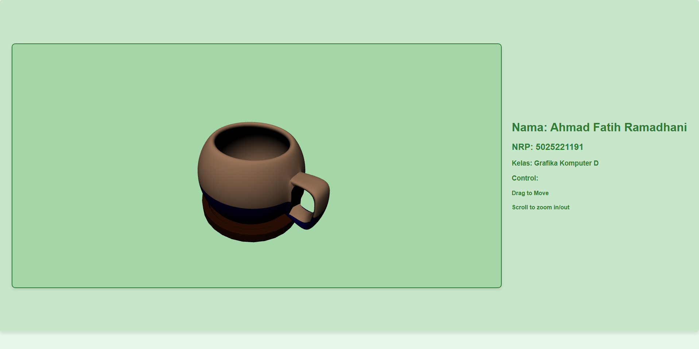

# TUGAS MEMBUAT OBJEK 3D MENGGUNAKAN WEBGL

## Mata Kuliah Grafika Komputer D

## Insititut Teknologi Sepuluh Nopember

## Ahmad Fatih Ramadhani - 5025221191

This project involves displaying and interacting with 3D models using WebGL. It includes components for handling mouse input, parsing .obj and .mtl files, rendering the 3D model with shaders, and responding to user interactions such as rotation and zoom.

## Features

- **Model Interaction:**
  - Rotate the model by dragging the mouse.
  - Zoom in/out using the scroll wheel.

- **File Parsing:**
  - Supports parsing of .obj files to extract geometries, textures, and normals.
  - Supports parsing of .mtl files to apply material properties to the model.

## File Structure

The code consists of three main parts:

1. **IOHandler (createIOHandler function):**
   - This function listens for mouse events on the canvas for handling user interactions:
     - **Mouse Down**: Starts dragging and tracks the mouse position.
     - **Mouse Move**: Updates the rotation based on mouse movement.
     - **Mouse Up**: Ends dragging.
     - **Wheel (Zoom)**: Adjusts the zoom level based on mouse scroll.

2. **MTL Parser (parseMTL function):**
   - The `parseMTL` function parses the .mtl file to extract material properties such as ambient, diffuse, specular colors, and shininess. It supports the following material properties:
     - `Ka` (ambient color)
     - `Kd` (diffuse color)
     - `Ks` (specular color)
     - `Ns` (shininess)
     - `map_Kd` (diffuse texture map)

3. **OBJ Parser (parseOBJ function):**
   - The `parseOBJ` function parses the .obj file to extract vertex positions, texture coordinates, normals, and faces.
   - It also handles the assignment of materials using the `usemtl` keyword and groups using the `g` keyword.
   - The output is a list of geometries with associated material data.

## Usage

1. **Initialization:**
   - The `main` function fetches the .obj and .mtl files, parses them using the `parseOBJ` and `parseMTL` functions, and sets up shaders and buffers for rendering the 3D model.

2. **Rendering Loop:**
   - A `render` loop is initiated using `requestAnimationFrame`, which continuously updates the scene based on the current rotation, zoom, and other transformations.

3. **Interaction Handling:**
   - The `createIOHandler` function is called to enable user interaction (dragging to rotate and scrolling to zoom).

## Key Functions

- **createIOHandler(canvas):** 
  Handles mouse events to allow rotation and zooming of the 3D model on the canvas.

- **parseMTL(text):** 
  Parses the .mtl file to extract material properties.

- **parseOBJ(text):**
  Parses the .obj file to extract geometry data such as vertices, normals, and textures.

- **main():** 
  The main function that sets up the WebGL context, loads the .obj and .mtl files, and renders the model with shaders. It also handles user interactions such as rotation and zooming.

### main.js Breakdown

The `main.js` file is crucial for initializing and rendering the 3D model using WebGL. It performs the following tasks:

1. **WebGL Setup:**
   - The `main()` function begins by selecting the canvas element and obtaining the WebGL context (`gl`).
   - If WebGL is available, it proceeds to create the shader programs and load the 3D model and material files (`.obj` and `.mtl`).

2. **Shaders:**
   - **Vertex Shader (`vs`)**: This shader processes vertex positions and normals, applies transformations (such as projection and world transformations), and passes the necessary data to the fragment shader.
   - **Fragment Shader (`fs`)**: This shader calculates the lighting and applies material properties to the model based on the light direction and diffuse color.

3. **Loading Model Files:**
   - The `.obj` file is fetched and parsed to extract the geometry data (positions, normals, and faces).
   - The `.mtl` file is fetched and parsed to extract material properties like the diffuse color, which are then applied to the corresponding geometries.

4. **Buffers and Geometries:**
   - The parsed geometries are stored in buffers for efficient rendering. Each geometry is associated with its material properties.

5. **Rendering Loop:**
   - The `render()` function continuously updates the scene. It calculates transformations (translation, rotation) and updates the camera view. The scene is rendered by setting WebGL buffers and uniforms, and drawing the model using the buffer data.

6. **User Interaction:**
   - The `createIOHandler` function listens for mouse events to allow the user to interact with the 3D model. The model can be rotated by dragging the mouse and zoomed in/out using the scroll wheel.

## Example

After initializing the WebGL context and parsing the files, the 3D model will be displayed on the canvas. The user can interact with the model by dragging the mouse to rotate it and using the scroll wheel to zoom in and out.

## Dependencies

- WebGL context for rendering.
- shaders for material effects (vertex and fragment shaders).
- `webglUtils` for handling buffer creation and shader program setup.

## How to Run

1. Ensure that you have a server running to serve the .obj and .mtl files (e.g., using a local server like [live-server](https://www.npmjs.com/package/live-server)).
2. Open the `index.html` file in your browser.
3. Interact with the model using mouse dragging and scrolling.

## Notes

- The .obj file format is parsed for basic geometry data (vertices, normals, and textures). Advanced features such as multi-material or complex texture mapping are not fully supported.
- The .mtl file format is parsed to apply basic material properties to the model.
